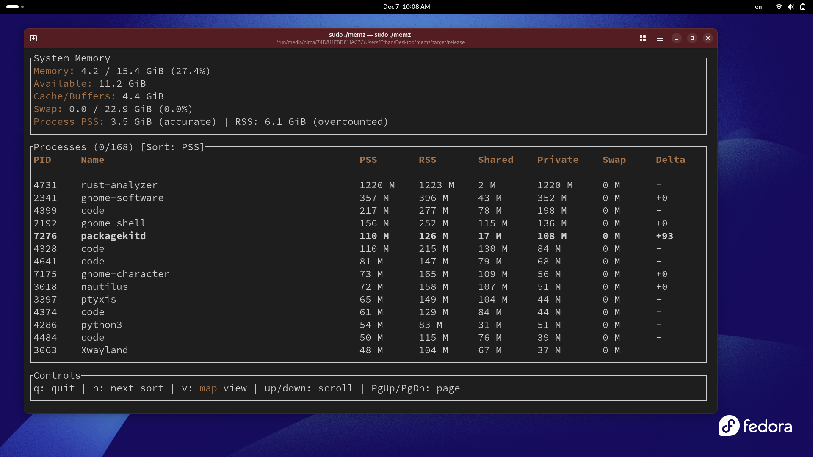
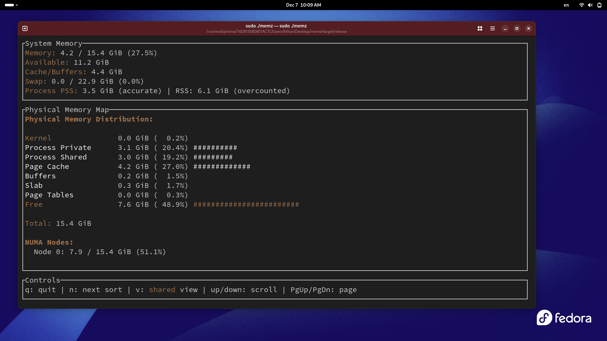
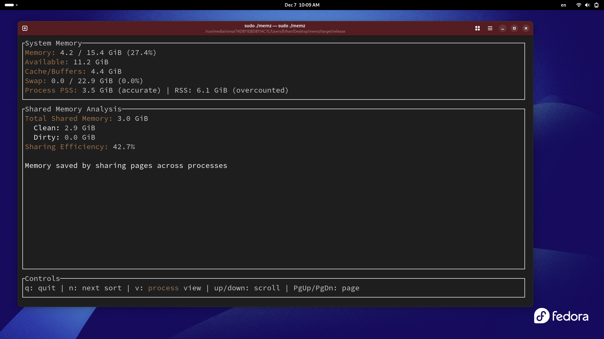

# MEMZ

Advanced Linux memory analyzer with real-time process tracking and system-level memory profiling.

## Overview

MEMZ is a terminal-based memory analysis tool designed for Linux systems. It provides detailed visibility into memory usage patterns by parsing kernel procfs data and presenting it through an interactive TUI interface. The tool focuses on accurate memory accounting using Proportional Set Size (PSS) metrics rather than traditional RSS measurements.

**Target Use Case**: System administrators and developers who need precise memory usage data for debugging, performance analysis, or capacity planning on Linux servers and workstations.

## Features

- **Process Memory Tracking**: Real-time PSS, RSS, shared, and private memory metrics per process
- **System-Level Statistics**: Total memory, swap, cache, and buffer monitoring
- **Physical Memory Mapping**: Kernel vs userspace memory distribution breakdown
- **Shared Memory Analysis**: Quantifies memory sharing efficiency across processes
- **NUMA Awareness**: Per-node memory statistics on NUMA systems
- **Interactive Navigation**: Sortable process lists, multiple view modes, keyboard-driven interface

## System Requirements

- Linux kernel 4.14+ (for smaps_rollup support)
- Root privileges (required for /proc access)
- Terminal with UTF-8 support

## Installation

### Prerequisites

**Operating System**: Linux only (tested on kernel 4.14+)

**Rust Toolchain**:
```bash
curl --proto '=https' --tlsv1.2 -sSf https://sh.rustup.rs | sh
```

**System Requirements**:
- Linux kernel 4.14 or newer (for `/proc/[pid]/smaps_rollup`)
- Root access (sudo)
- UTF-8 capable terminal

### Build Steps

1. Clone or extract the project:

```bash
git clone https://github.com/naseridev/memz.git
```

```bash
cd memz
```

2. Build the release binary:
```bash
cargo build --release
```

The compiled binary will be at `target/release/memz`.

### Verification

Check kernel version:
```bash
uname -r
```

Ensure you have 4.14 or higher. Older kernels lack `smaps_rollup` and will cause the tool to fail.

## Usage

### Starting MEMZ

Run with sudo (root privileges required):
```bash
sudo ./target/release/memz
```

The terminal will switch to an alternate screen showing live memory data.

### Interface Layout

The TUI is divided into three sections:

1. **Top Panel**: System-wide memory statistics (RAM, swap, cache)
2. **Middle Panel**: Main content area (changes based on view mode)
3. **Bottom Panel**: Keyboard controls

### Keyboard Controls

| Key | Action |
|-----|--------|
| `q` | Quit the application |
| `n` | Cycle through sort modes (PSS -> RSS -> Shared -> PID) |
| `v` | Switch view mode (Processes -> Memory Map -> Shared Memory) |
| Up/Down | Scroll one line up/down |
| PgUp/PgDn | Scroll one page up/down |

### View Modes

#### 1. Processes View (Default)

Displays a table of running processes with columns:
- **PID**: Process identifier
- **Name**: Process name from `/proc/[pid]/comm`
- **PSS**: Proportional Set Size (accurate memory usage)
- **RSS**: Resident Set Size (may overcount shared memory)
- **Shared**: Total shared memory pages
- **Private**: Memory unique to this process
- **Swap**: Swapped-out memory
- **Delta**: PSS change since last refresh (megabytes)

Processes are sorted by the current sort mode (default: PSS descending).

#### 2. Memory Map View

Shows physical memory distribution:
- Kernel reserved space
- Process private/shared memory
- Page cache and buffers
- Slab allocator usage
- Free memory

On NUMA systems, displays per-node memory statistics.

#### 3. Shared Memory View

Analyzes memory sharing across processes:
- Total shared memory (clean + dirty pages)
- Sharing efficiency percentage (memory saved by sharing)

## Understanding Memory Metrics

### PSS vs RSS

**RSS (Resident Set Size)**: Total physical memory used by a process, including fully counted shared libraries. Multiple processes sharing the same library will have overlapping RSS values.

**PSS (Proportional Set Size)**: RSS adjusted for shared pages. If a page is shared by N processes, each process accounts for 1/N of that page. PSS provides accurate per-process memory usage without double-counting.

**Rule of thumb**: Sum of all RSS values exceeds total system memory usage. Sum of all PSS values matches actual memory consumption.

### Memory Types

- **Shared Clean**: Unmodified pages shared between processes (e.g., read-only library code)
- **Shared Dirty**: Modified pages shared between processes (e.g., shared memory segments)
- **Private Clean**: Unmodified pages unique to one process
- **Private Dirty**: Modified pages unique to one process (stack, heap)

## Screenshots

### Processes View


### Memory Map View


### Shared Memory Analysis


## Troubleshooting

### "Unsupported operating system"

MEMZ only works on Linux. It reads from `/proc`, which doesn't exist on macOS or Windows.

### "This tool requires root privileges"

Run with `sudo`. Non-root users cannot access `/proc/[pid]/smaps_rollup` for all processes.

### "Kernel version X.X detected... requires 4.14+"

Your kernel lacks `smaps_rollup` support. Options:
1. Upgrade kernel (recommended)
2. Modify the code to use `/proc/[pid]/smaps` (slower, but works on older kernels)

### Terminal display issues

Ensure your terminal supports UTF-8 and has sufficient size (minimum 80x24 recommended).

### High CPU usage

MEMZ refreshes every second. On systems with thousands of processes, parsing `/proc` can be CPU-intensive. This is expected behavior.

## Performance Characteristics

- **Memory overhead**: ~5-10 MB for the tool itself
- **Refresh rate**: 1 second (hardcoded in `main.rs`)
- **Scaling**: Parses O(N) processes; 1000 processes = ~50ms collection time on modern hardware

## Limitations

- Linux-only (requires procfs)
- Cannot track memory outside procfs (kernel internal structures, DMA buffers)
- PSS calculation is a kernel estimation, not exact
- Requires root (no workaround for security-restricted systems)
- No historical data persistence (resets on restart)

## Use Cases

### Development
- Identify memory leaks during testing
- Compare memory footprint of different implementations
- Verify memory usage matches expectations

### System Administration
- Diagnose out-of-memory conditions
- Plan memory capacity for workloads
- Monitor memory consumption trends

### Performance Analysis
- Evaluate cache/buffer effectiveness
- Analyze memory sharing in containerized environments
- Debug swap usage patterns

## Advanced Tips

### Comparing PSS vs RSS

Press `n` to cycle to RSS sort mode. Compare the "Process PSS" and "RSS" values in the top panel. The difference represents overcounted shared memory.

### Monitoring specific processes

Start MEMZ, then note the PID of your target process. Press `n` until sorted by PID, then scroll to find it. The Delta column shows memory growth over time.

### NUMA awareness

On multi-socket servers, the Memory Map view shows per-node statistics. Uneven distribution may indicate NUMA placement issues.

## Technical Documentation

For implementation details, architecture, and in-depth technical documentation, see [WIKI](README.wiki.md).
